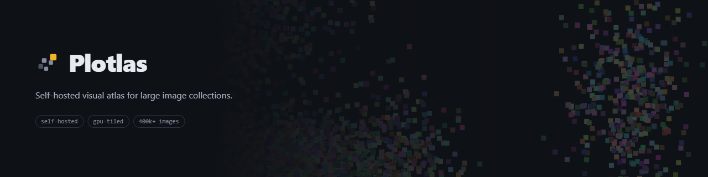

<p align="center">
  
</p>

# Plotlas

**Explore a very large image collection as one zoomable space, in your browser.**

Plotlas turns a folder of images — plus an optional metadata file — into a single
continuous landscape you can pan and zoom, arrange by date or category, filter, and
dive into at full resolution. It is built for collections too big to browse a page at a
time: it has been run on a corpus of a million images in a single browser tab.

You run it yourself, on your own machine or server. Your images never leave it.

- **Website and live demo:** [plotlas.com](https://plotlas.com)
- **Licence:** free for noncommercial use ([PolyForm Noncommercial 1.0.0](LICENSE.md));
  commercial use needs a separate licence ([COMMERCIAL.md](COMMERCIAL.md))

## Quick start

You need **Docker**, with Compose v2. Nothing else — Python, Node and libvips all run
inside the images.

```bash
git clone https://github.com/Plotlas/plotlas
cd plotlas
docker compose up --build
```

Then open **<http://localhost:8080>**.

The stack builds on first run, which takes a few minutes. You will land on an empty
library — that is correct, there are no collections until you add one. Click "New 
Dataset" to create your own.

To stop it:

```bash
docker compose down
```

Your collections live in **`./data`** — a plain folder, not a Docker volume. So they
survive `docker compose down -v`, you can back them up with `tar`, and you can move an
installation by moving the folder. Set `DATA_DIR` in `.env` to keep them elsewhere.

### Updating

Each release is published here as one squashed commit on top of the last, so an update
is an ordinary pull and rebuild:

```bash
git pull
docker compose up --build
```

Your collections in `./data` are not touched by an update.

If `git pull` instead reports **`fatal: Need to specify how to reconcile divergent
branches`**, you cloned during an early period when a release *replaced* the published
history rather than adding to it — so your copy and the current one share no common
commit. None of the three strategies git suggests can bridge that. Reset to the
published branch once, and pulls behave normally from then on:

```bash
git fetch origin
git reset --hard origin/main
```

That discards local edits to the checkout. It does not touch `./data`.

## Add your own images

You can add datasets via the frontend UI interface, but it will be faster if you point
Plotlas at existing images on your hard-drive for larger sets.

The `--sync` flag runs the work in the foreground so you can watch it. Point `-v` at a
folder on your machine; it is mounted read-only and never modified.

```bash
docker compose run --rm \
  -v /path/to/images:/inputs/images:ro \
  worker pixscope ingest --sync \
    --images /inputs/images \
    --dataset-id my-collection
```

That gives you the grid arrangement, which needs no metadata at all.

### With a metadata CSV

A CSV is matched to your images **by filename** and unlocks the other arrangements. You
must say which columns mean what, and which arrangements to build — Plotlas never
guesses from your column names:

```bash
docker compose run --rm \
  -v /path/to/images:/inputs/images:ro \
  -v /path/to/metadata.csv:/inputs/metadata.csv:ro \
  worker pixscope ingest --sync \
    --images /inputs/images \
    --metadata /inputs/metadata.csv \
    --datetime captured \
    --categorical genre \
    --tag keywords:'|' \
    --layout grid,datetime,categorical \
    --dataset-id my-collection
```

| flag | meaning |
|---|---|
| `--filename` | the CSV column holding the image filename (default: `filename`) |
| `--datetime COLUMN` | a date column — enables the date arrangement |
| `--categorical COLUMN` | a category column — repeatable, one arrangement each |
| `--tag COLUMN:DELIM` | a multi-value column for filtering — repeatable |
| `--layout` | **which arrangements to build.** Defaults to `grid` alone, so name the others explicitly or you will not get them. |

Run `docker compose run --rm worker pixscope ingest --help` for the full set.

> **On Windows using Git Bash**, prefix the command with `MSYS_NO_PATHCONV=1` or your
> `-v` paths will be rewritten and the mount will fail.

Ingesting prepares a collection once, offline: images are packed into layers of
pre-rendered tiles, so that panning and zooming later stream only what is on screen.
Large collections take a while to prepare and use real disk space — both scale with the
number of images and their resolution.

## Verifying your build

The test suite ships with the code so that you can confirm the software behaves as
described rather than taking this README's word for it.

```bash
# Application and contract tests
docker build -f docker/Dockerfile.test -t plotlas-test .
docker run --rm -v "$PWD:/repo" plotlas-test \
  pytest packages/api/tests packages/pipeline/tests tests/contract -q

# Image-processing tests (needs libvips, so they run in the worker image)
docker build -f docker/Dockerfile.worker -t plotlas-worker .
docker run --rm -v "$PWD:/repo" -w /repo plotlas-worker \
  pytest packages/pipeline/tests -q -m native

# Frontend
docker compose run --rm --no-deps frontend \
  sh -c "npm install && npm run typecheck && npm run test"
```

> Some test files mention `make` targets in their docstrings. Those refer to shortcuts
> used in the project's own development repository and are not published here — the
> commands above are the equivalents.

## Deploying it publicly

`docker-compose.yml` is the development stack: it serves the frontend through a live dev
server and keeps every guard relaxed so that local work is quick. **Do not expose it to
the internet.**

For a public deployment there is a second, standalone profile:

```bash
cp .env.example .env      # then fill in JWT_SECRET, ALLOWED_ORIGINS, ACME_EMAIL
docker compose -f docker-compose.public.yml up -d
```

It differs deliberately:

- **No worker, no job queue** — it cannot ingest at all. Prepare collections elsewhere
  (or locally with the stack above) and copy the dataset folder across. A read-only
  server has no write path to attack.
- **The frontend is built once** into static files rather than served by a dev server.
- **The production guards activate.** With `APP_ENV=production` the application
  *refuses to start* if `JWT_SECRET` is missing, too short, or left at the example
  value, or if `ALLOWED_ORIGINS` is unset or a wildcard. A misconfigured deployment
  fails loudly instead of running insecurely.
- **Certificates are obtained automatically** for the domain you configure.

Run it **standalone**, exactly as above — do not layer it on `docker-compose.yml`, which
would reintroduce the worker and the development bind mounts it deliberately drops.

Ingesting prepares a collection once, offline: images are packed into layers of
pre-rendered tiles, so that panning and zooming later stream only what is on screen.
Large collections take a while to prepare and use real disk space — both scale with the
number of images and their resolution.

## What you can do with it

- **Arrange by grid** — needs no metadata at all.
- **Arrange by date** — a timeline histogram with a calendar axis.
- **Arrange by category** — one labelled block per value.
- **Arrange by any two numbers** — including coordinates you computed yourself, so an
  embedding run through UMAP or t-SNE becomes a similarity map.
- **Arrange geographically** — latitude and longitude as a map, equirectangular or Web
  Mercator.
- **Search** for a value and fly straight to it; searching a category snaps to the whole
  group.
- **Filter by tag**, highlighting matches and dimming everything else.
- **Click any image** for its full metadata, then zoom it to full resolution.

Arrangements are always computed from **your metadata** — never from the pixels. Plotlas
does not analyse image content to decide where a picture goes.

## Data, privacy and network access

- **The running application makes no outbound network calls.** No telemetry, no
  analytics, no third-party fonts or scripts, no licence or update checks. This is
  verifiable in the source: neither the API nor the pipeline imports an HTTP client, and
  the frontend contains no external URLs.
- **Everything stays where you put it** — originals, prepared tiles, metadata and
  accounts all live in a Docker volume on your own host.
- **It runs air-gapped** once the images are built.

[`ARCHITECTURE.md`](ARCHITECTURE.md) explains the data flow, exactly what is written to
disk, and how to verify these claims for yourself.

## Project structure

| Package | Purpose |
|---------|---------|
| `packages/pipeline` | Prepares a collection: discovers images, joins the optional metadata, computes the arrangements, and bakes the tile pyramid the browser reads. |
| `packages/api` | Serves prepared collections — tiles, metadata queries, search — and owns accounts and dataset ownership. |
| `packages/frontend` | The viewer. Renders the collection with WebGL and talks only to the API. |
| `schemas/v2/` | The data contract shared between the pipeline and the API. |

Data flows one way: `pipeline` → `api` → `frontend`.

## Documentation

- [`ARCHITECTURE.md`](ARCHITECTURE.md) — how the pieces fit together, what lands on
  disk, the network and access model, and how to verify it yourself
- Each package has its own `README.md` covering local setup:
  [`pipeline`](packages/pipeline/README.md) · [`api`](packages/api/README.md) ·
  [`frontend`](packages/frontend/README.md)

## Would rather not run it yourself?

We will prepare and host a collection for you and give you a link to share — useful if
you have the images but not the infrastructure. Get in touch at **hello@plotlas.com**.

## Issues and contributions

Bug reports and questions are welcome — please open an issue. Forks are welcome too.

We are not actively seeking code contributions and cannot promise review turnaround, so
if you are planning something substantial, open an issue before a large pull request.

Other addresses: **licensing@plotlas.com** for commercial licensing, and
**legal@plotlas.com** for takedown or data requests.

## Licence

Free for noncommercial use under the [PolyForm Noncommercial License 1.0.0](LICENSE.md).
**Commercial use requires a separate licence** — see [COMMERCIAL.md](COMMERCIAL.md).
"Plotlas" is a trademark; see [TRADEMARK.md](TRADEMARK.md). Attribution requirements are
in [NOTICE](NOTICE).
